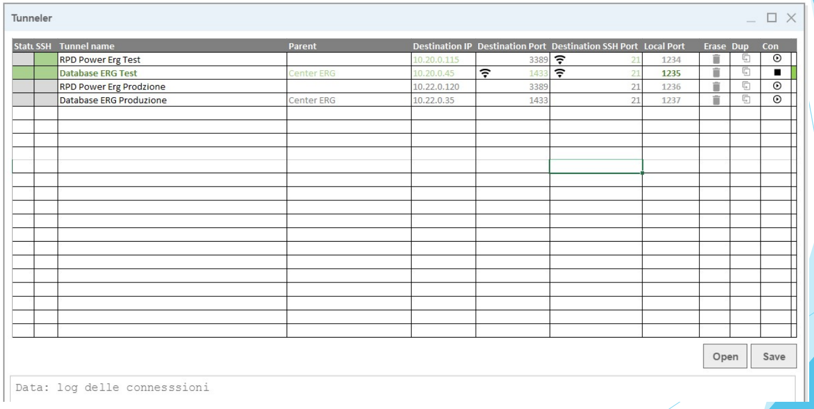

# Traccia

Realizzare un network monitor in grado di:

1. Mostrare in un elenco una serie di test verso alcuni Host raggiungibili in rete
2. L'elenco dei test va letto da un file
3. Il risultato dei test va salvato in un file
4. I test possibili sono di tre tipi: ping, telnet e HTTP Get
5. Il lancio della batteria di test va legato ad un bottone

## La struttura del file dei test

## Progetto di partenza
Realizzare in c# una applicazione in grado di eseguire il ping su un indirizzo indicato in una textbox. 

(using System.Net.NetworkInformation;)

- durante l'operazione il cursore del mouse deve risultare in attesa e i campi status e time devono essere vuoti
- ad operazione terminata visualizzare il tempo e lo status
- per eseguire i ping di prova individuare l'indirizzo IP dei computer del laboratorio, del proprio smartphone e di altri nodi sulla rete
- aggiungere icone di successo/errore/linea lenta

Codice di esempio:

            this.Cursor = Cursors.Wait
            txtStatus.Text = "";
            txtMs.Text = "";
            string Indirizzo = txtIP.Text;
           
            Ping pinger = new Ping();
            PingReply reply = pinger.Send(Indirizzo);
            string status = reply.Status.ToString();
            string millisec = reply.RoundtripTime.ToString();
            txtStatus.Text = status;
            txtMs.Text = millisec;
            this.Cursor = Cursors.Arrow;
